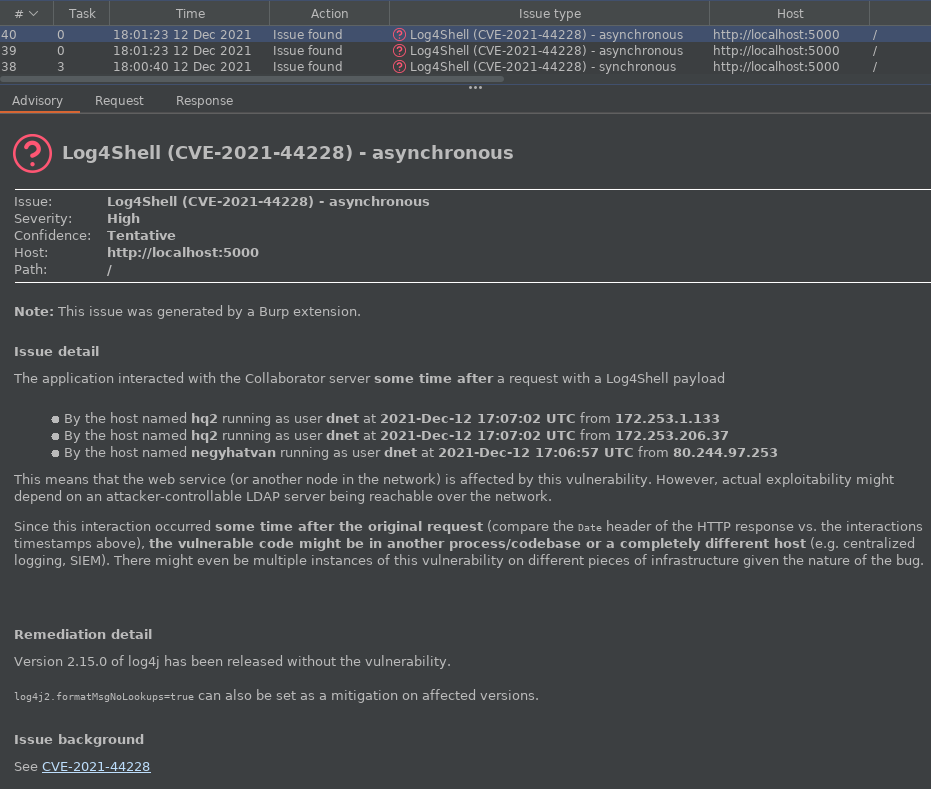

Log4Shell scanner for Burp Suite
================================

Detailed description can be found [in our blog post about this plugin][1].

Comparison
----------

| Feature | Log4Shell scanner (this one) | ActiveScan++ (PortSwigger/active-scan-plus-plus@b485a07) |
| --- | :---: | :---: |
| Synchronous detection | ✔️ | ✔️ |
| Asynchronous detection | ✔️ | ❌ |
| Hostname detection | ✔️ | ❌ |
| Username detection | ✔️ | ❌ |
| Ability for single-issue scan (see below) | ✔️ | ❌ |

Single-issue scan
-----------------

If you'd like to scan only for Log4j (and not other things such as XSS or SQLi),
this plugin makes it possible.

By following any of the instruction sets below, the the scanner will only
perform Log4Shell checks on all insertion points if the scan configuration
created as a result is used.

### The easy way ###

Although it might seem that this one has two more items, step 3 of the
harder way involves ticking 152 checkboxes in a box that only displays 16
at a time.

1. Save [`extensions-only.json`][2] to your machine
2. From the leftmost `Burp` menu, select `Configuration library`
3. Click `Import` on the right side of the window
4. Select the location where you save the file in step 1.
5. When creating a new scan, click `Select from library` on the `Scan configuration` tab
6. Disable every other extension (if applicable) that have an active scan check registered (such as ActiveScan++, Backslash powered scanning, Burp Bounty, etc.) so that only the Log4Shell scanner runs

### The harder way ###

1. Create a new `Scan Configuration`
2. Expand `Issues Reported`
3. Uncheck every single one of them except the last called `Extension generated issue`
4. Disable every other extension (if applicable) that have an active scan check registered (such as ActiveScan++, Backslash powered scanning, Burp Bounty, etc.) so that only the Log4Shell scanner runs

Building
--------

Execute `./gradlew build` and you'll have the plugin ready in
`build/libs/burp-log4shell.jar`

License
-------

The whole project is available under the GNU General Public License v3.0,
see `LICENSE.md`.

[1]: https://blog.silentsignal.eu/2021/12/12/our-new-tool-for-enumerating-hidden-log4shell-affected-hosts/
[2]: https://raw.githubusercontent.com/silentsignal/burp-log4shell/master/extensions-only.json
